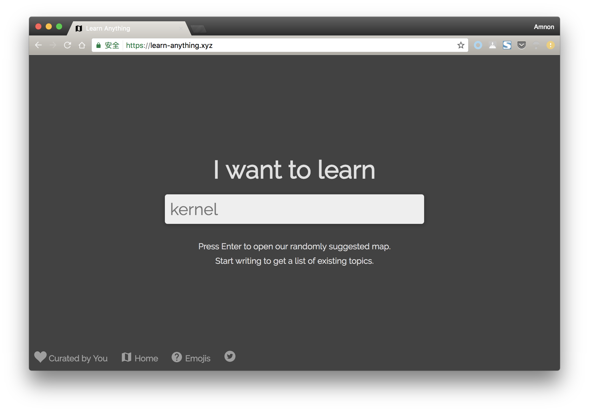
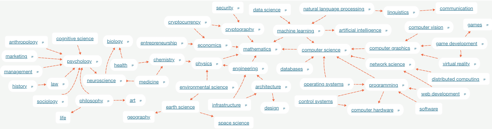
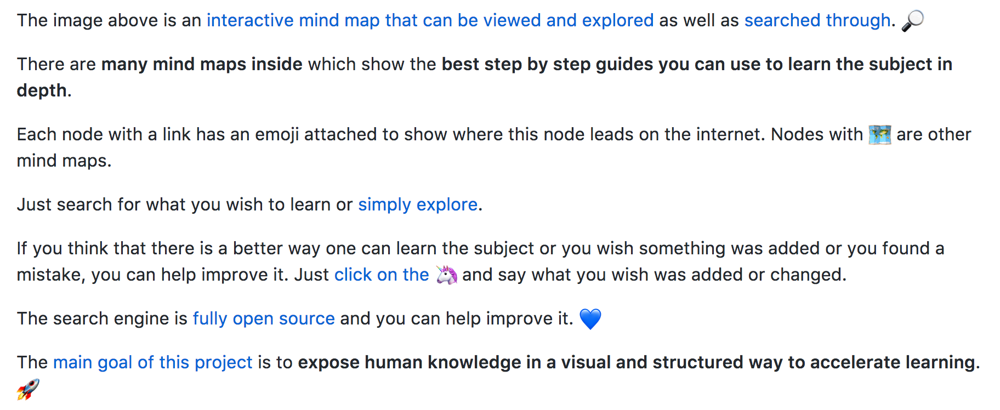

## 前言
闲来无事逛逛 [Github 趋势](https://github.com/trending)，发现这么一个[仓库](https://github.com/nikitavoloboev/learn-anything)，按图索骥，打开一看 [learn-anything](https://learn-anything.xyz)。
好家伙，怎么知道我喜欢学习，想要学习呢？

## 介绍
话不多说，直接上图：

涉及的内容有：

Github 上的介绍大家可以看看。

我觉得还是很有趣的，推荐给大家瞧瞧看看，收藏起来，玩弄一下，不敢私藏，特发博文分享一下，祝大家也有所收获！

## 后续

吐槽：现在的 JavaScript 和 Python 如日中天呀，基本上都是他们在发布新内容，想想自己手里头会的，惭愧。让我静静～～

_图片来源：Google Search，侵删_
