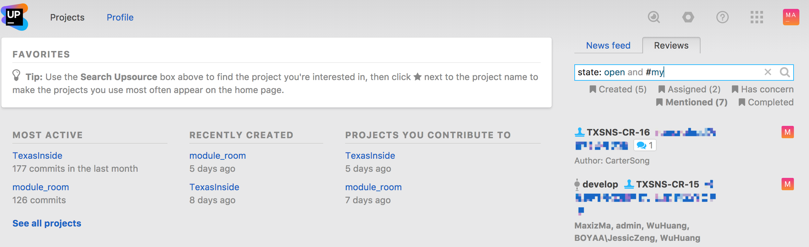
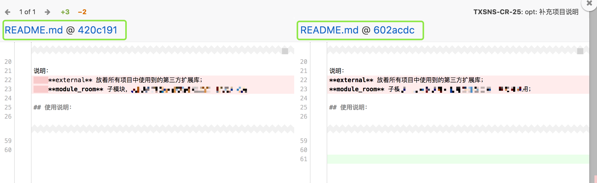
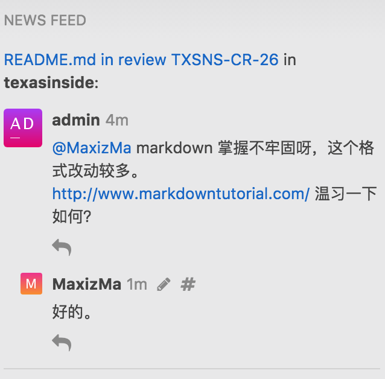

## Code Review 的目的

看看 Wiki 百科怎么说吧，[维基百科：代码审查](https://zh.wikipedia.org/wiki/代码审查)

**总结起来，有这么几个方面：**

- 传播知识
    + 让其它并不熟悉代码的人知道作者的意图和想法，从而在以后轻松维护代码。
    + 促使大家相互学习对方的长处和优点。
- 增进代码质量
    + 让你的代码可以更好的组织起来，更容易阅读，具有更高的可维护性。
- 找出潜在的 bug
    + 顺便进行的意外收获。

**不应该出现的：**

- 检查代码风格和编程规范
    + 当前初始时期的附加责任而已，代码符合规范属于每个人自己的事情
    + 规范遵守看这里：[项目代码规范指南](../lua-code-style)
- 检查常规的 [bad smell](https://zh.wikipedia.org/wiki/%E4%BB%A3%E7%A0%81%E5%BC%82%E5%91%B3) 和代码 Bug
    + 应该依赖于 IDE 和静态代码检查工具

## Code Review 的执行

- commit 代码时，分功能提交。
- 不要吝啬你的评价，Code Review 是一个互相学习的过程。
- 及时 review 代码，确保当天的 review 任务当天完成。
- 认真 review 代码，为你花费的时间负责，**宁可不 review 也不可草率 review **。

### 功能开发 Code Review 策略

- 新功能开发，需进行内部技术评审，制定功能技术方案。
- 新功能开发，reviewer 为参与技术评审的开发全程 review 开发人员代码。

### review 回归

- 在新的提交信息里面注明回归的 review ID，目前 review id 模板为 **TXSNS-CR-XX**，这样该次提交将直接并入前次 review，不会产生新的 review。

## Code Review 策略

- 每次提交随机指定 **2 名 reviewer** 和 **1 名 watcher** 。
- 每周整理输出未经过 review 的 commit 。

## Code Review 工具

- 使用 [upsource](https://www.jetbrains.com/upsource/) 构建后台，让我们轻松愉快的 Code Review
- 地址：[http://192.168.97.2:40001](http://192.168.97.2:40001)

**Upsource能为代码审查提供哪些便利**

- 对多种类型的代码库与软件开发语言进行代码浏览
- 对同一个代码库的多个修订版本进行浏览，并且通过一个图形化工具显示多个修订版本之间的关系
- 对代码变更进行跟踪，包括提交历史、变更差异比较，以及分支与合并的操作
- 对团队的代码进行审查，包括代码的讨论、跟踪代码评论以及最终的结论

### 如何进行代码审查

- 当开发者 A 提交完代码之后，项目管理员 B 登录到 Upsource ，可以看到所有项目的索引，每个项目都有对应一个特定的 VCS 仓库。

- 单击项目名称列出每一次提交的版本，每一次提交的代码罗列，这里你可以浏览代码，创建代码审核，分支列表，分支与分支代码比较，代码提交代码审核分析（可视化图表）……等等你想要的功能。 

- 拖动滚动条，将光标移动到需要进行审核的修订版本上，点击 Create review 创建一次新的代码审查 

### 代码对比

- 点击左边修订版中提交的文件名显示嵌入差异：

- 点击Side-by-side diff可以查看整个文件在提交前后的变化 

### 关于代码评论

无论你是作为一个 author 、 reviewer 或 watcher ，你都可以发表评论，发表的评论所有参与的人都可以看得见

**有三种类型的评论：**

- 审查意见：这种类型的评论是不是捆绑到任何代码特定文件或部分。
- 行级评论：这种类型的注释与特定的代码行相关联。
- 代码块评论：这种类型的评论是为了找出一个特定的代码片段中的一个文件进行审查。

**行级评论**

**代码块评论**

评论一下：

### 参与评论

B 进行评论后，开发者 A 会收到邮件通知，登录 A 账户，可以清晰的看到 B 的评论的代码，可以进行回复

当点击 Accept 时，表示接受此次修订，此次审查被视为完成。 

### Upsource 分析功能

Upsource 提供了例如代码提交分析、代码审查分析等功能。

这些方便我们后期进行统计和分析。

### 关于 review 之后的代码改动

每次 review 有一个 ID，对应的人在针对修改意见提交修改的时候，可以在提交记录中把 ID 带上， Upsource 会根据 ID 自动合并你的提交原来那个 ID 那里，这样不会出现多余的 review 记录。

### 总结

Upsource 是一款简单易用，社交属性强的 code review 工具，我想，大家会越来越爱上 Code Review 。以后见面不问其他就问，**今天你 Review 了么**？
