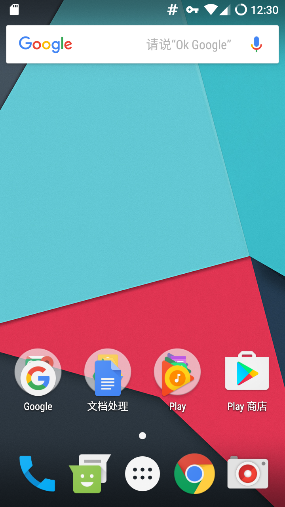
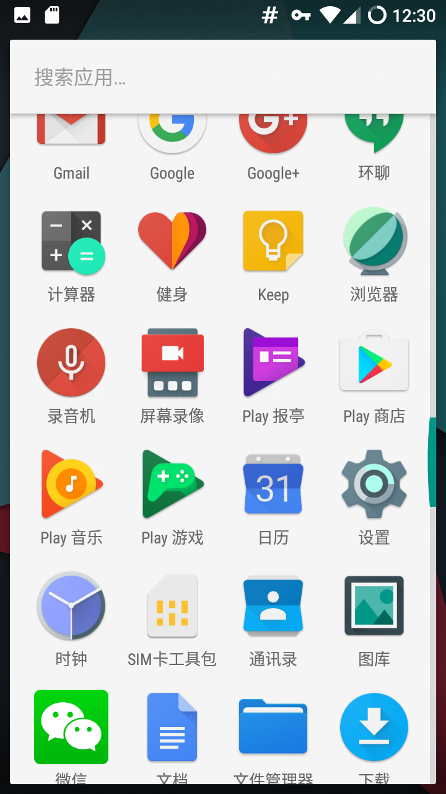

## 退役的三星 S3 复活了
### 前言
冷藏了一年多的三星 S3 今天心血来潮拿出来想刷一个新的系统，于是把目光瞄准了 [CM](http://www.cyanogenmod.org/) ，一个口碑极好的 Android 系统提供者。
首先肯定是找到我的 [S3](https://download.cyanogenmod.org/?device=i9300) 的页面寻找对应的 ROM ，意外的发现居然支持到 CM13 了，也就是 Android 6.0 了，这让我受宠若惊，于是果断的下载 Release 版本，顺便把 Recovery 也下载了，浏览中还发现 [CM14](http://www.cyanogenmods.org/forums/topic/galaxy-s3-cm14-cyanogenmod-14-nougat-rom-i9300/) 都有了，几年前的设备居然没有被抛弃，为 CyanogenMod 点个赞，希望越来越好。
**PS：**更多关于 [WIKI](https://wiki.cyanogenmod.org/w/I9300_Info) 。

### 花絮
因为太久没有刷机了，很多东西都忘记了。手贱在刷入 CM13 的时候没有把 Recovery 也一起刷进去，于是安装完各种问题接踵而来。首先我需要一个 Recovery 来为我刷入 GApps 做准备，但是如何刷入 Recovery 呢？ 网上找到的关于适用 Fastboot 刷入 Recovery 感觉很靠谱，操作也简单，于是找到这个 [使用 adb fastboot 刷 CyanogenMod ROM](http://blog.aboutc.net/linux/72/brush-cyanogenmod-rom-using-adb-fastboot)，但最后卡在了 fastboot devices 这里，居然看不到有我的设备，那么为什么会找不到？ CyanogenMod 的官方提示是这样的。[Doc: fastboot intro](https://wiki.cyanogenmod.org/w/Doc:_fastboot_intro)，可是这里没有提供好的解决方案。让我本来是“半生熟”的抓不着头脑，就想既然 CyanogenMod 的 Recovery 刷不了，那么我看看有没有其他的？
转折点，于是找到了这个 [TWRP](https://twrp.me/devices/samsunggalaxys3internationalexynos.html)，另一个提供第三方 Recovery 的，也是广受刷机者喜爱的提供者，在这里下载了对应的 TWRP，这里走了一个弯路，我不知道 CyanogenMod 的系统已经是 Root 了的，也忽略了这里说的：
```Shell
su
dd if=/sdcard/twrp.img of=/dev/block/mmcblk0p6
```

如果早点看到的话，我就已经成功了，可惜没有如果。
最后也是第二天偶然看到，围魏救赵终于解决了，现在列一下正确的安装姿势。

### 步骤

1. [Download Rom](https://download.cyanogenmod.org/get/i9300-snapshot.zip)
2. Download [Recovery](https://download.cyanogenmod.org/get/i9300-snapshot-recovery.img)
3. Download [Google Apps](http://opengapps.org/)(use an ARM, 6.0 zip) 建议 **mini** 即可
4. 待所有下载准备就绪之后，全部放到 SDCARD 根目录下即可
5. 进入 Recovery 模式，关机状态下长按（音量下 + Home键 + 关机键）进入。
6. [双清](http://jingyan.baidu.com/article/64d05a027f1306de55f73ba9.html)
7. 安装 Rom 即可。 

### 其他问题

* 只安装了 CM13 Rom 然后安装 TMRP
参考了这个[How to Install TWRP 2.4 on Samsung Galaxy S3 I9300 and I9305](http://www.droidviews.com/how-to-install-twrp-2-4-on-samsung-galaxy-s3-i9300-and-i9305/)，在新安装的 Android 系统下有一个 **终端**，下面操作即可。

* 如何通过 Fastboot 安装 Recovery ？（待解决有知道的告诉我）

### 系统截图




