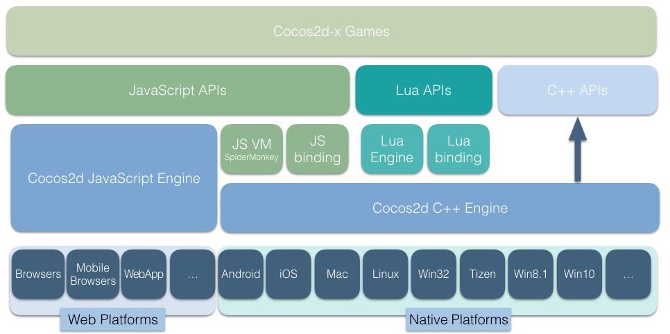
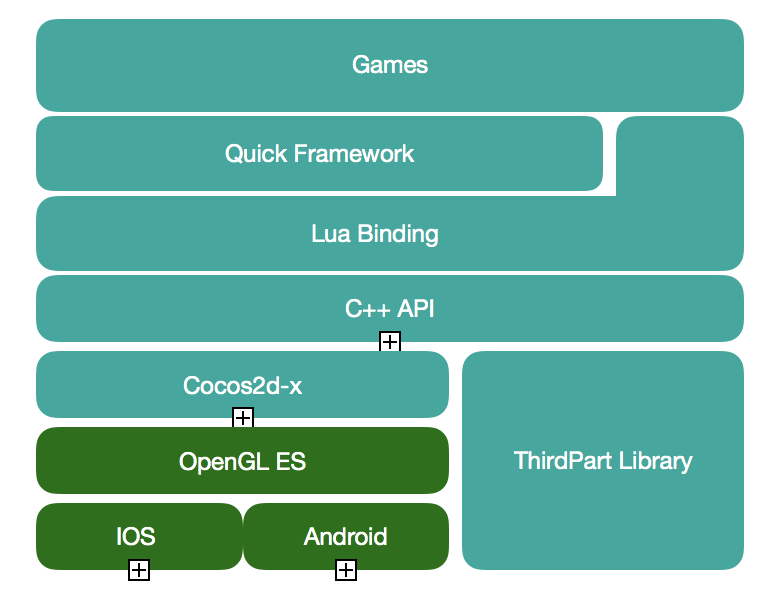
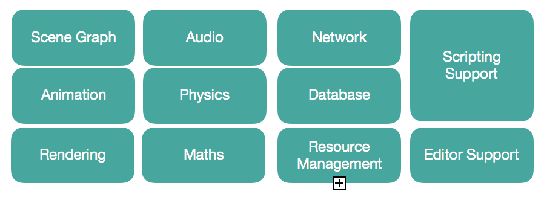

## 背景

最近想对我认识的游戏引擎进行一个总体的概述，然而在我的脑海中搜索了一圈，发现我其实未能愉快的让整个架构展示出来，于是花了点时间整理和组织了一下，把目前的接触的给大家展示一下，希望看官你喜欢。

## 主体内容

### 通用游戏引擎架构

摘自[「游戏引擎架构」](https://book.douban.com/subject/25815142/)

### Cocos2dx 引擎架构

摘自[Cocos2dx](https://github.com/cocos2d/cocos2d-x)

### Quick Cocos2dx Community 架构

从 [「Cocos2dx 之 Lua 核心编程」](https://book.douban.com/subject/27100997/)中用 Pages 绘制的

## 后续

目前只总结了两个，后面可能会对 [Unity](https://unity3d.com/cn) 和 [Unreal Engine](https://www.unrealengine.com/zh-CN/what-is-unreal-engine-4) 也进行一个整理汇总，可以让自己更清楚的认识他们的不同与相同。

