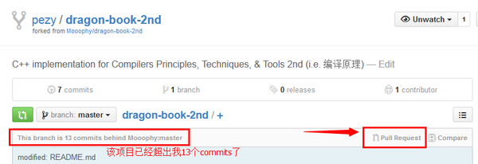
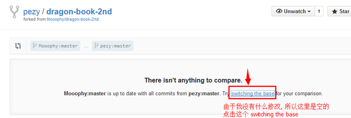
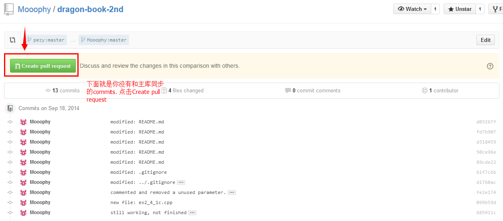
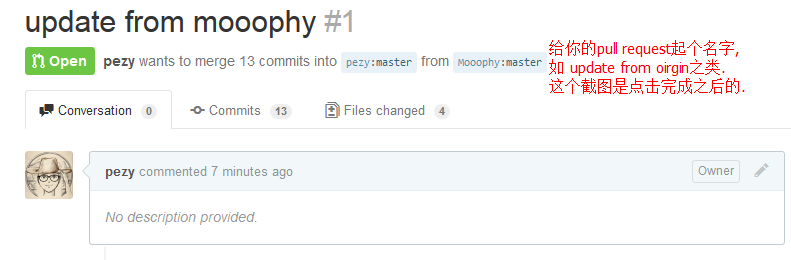

## 背景

最近在项目组内部尝试使用 Pull-Request 才参与其他人的开源项目，然后一段时间之后发现 Fork 的项目更新了，我这边的代码也有更新，但是还不想 Pull-Request ，于是就需要从那边同步代码过来，这里记录一下如何从 Fork 出来的项目更新最新的代码。

## 实施

网上找了一圈，发现有两种方案，一种是采用命令行形式，一种是直接在 Github 上操作，因为我们内部采用的不是 Github，也不是 OSChina 的 Git，于是只有第一种可以使用。

### Git 命令行操作

提示：跟上游仓库同步代码之前，必须配置过 remote，[指向上游仓库](https://help.github.com/articles/configuring-a-remote-for-a-fork/) 。

1. 从命令行窗口切换到当前项目下
2. 配置远程仓库，指向它
3. 拉取上游仓库更新
4. 切换本地仓库到 master 或者你要更新的分支
5. 通过 merge 命令从 upstream/master 分支合并代码
6. 提交并推送合并后的代码

下面是关于命令行的操作：

```bash
# ORIGINAL_OWNER 仓库的拥有者
# ORIGINAL_REPOSITORY 仓库的 Git 地址
# 自行替换
git remote add upstream https://github.com/ORIGINAL_OWNER/ORIGINAL_REPOSITORY.git

git fetch upstream
# remote: Counting objects: 75, done.
# remote: Compressing objects: 100% (53/53), done.
# remote: Total 62 (delta 27), reused 44 (delta 9)
# Unpacking objects: 100% (62/62), done.
# From https://github.com/ORIGINAL_OWNER/ORIGINAL_REPOSITORY
#  * [new branch]      master     -> upstream/master
  
git checkout master
# Switched to branch 'master'

git merge upstream/master
# Updating a422352..5fdff0f
# Fast-forward
#  README                    |    9 -------
#  README.md                 |    7 ++++++
#  2 files changed, 7 insertions(+), 9 deletions(-)
#  delete mode 100644 README
#  create mode 100644 README.md

git commit -am "merge from branch upstream/master ... "
git push

```

### Github 操作

因为这一块自己也没有动手实践，于是从参考的 Blog 那边直接盗图，如果有侵权请知会。







### OSChina 操作

之前使用过 OSChina 的同步，貌似更简单，直接一键就能操作了。

不信你看这里：


当然这种方式还是建立在没有做任何改动上，如果有做了一些改动，还是使用命令行来操作更稳妥。

## 后记

网上其实方便就能搜索到答案了，但是一些命令用的少的话，经常会忘记，而重新搜索的话会耗费不少时间，而只记录 URL 的话又不能加深印象，于是才有本文的存在。

## 参考

[如何同步 Github fork 出来的分支](https://jinlong.github.io/2015/10/12/syncing-a-fork/)
