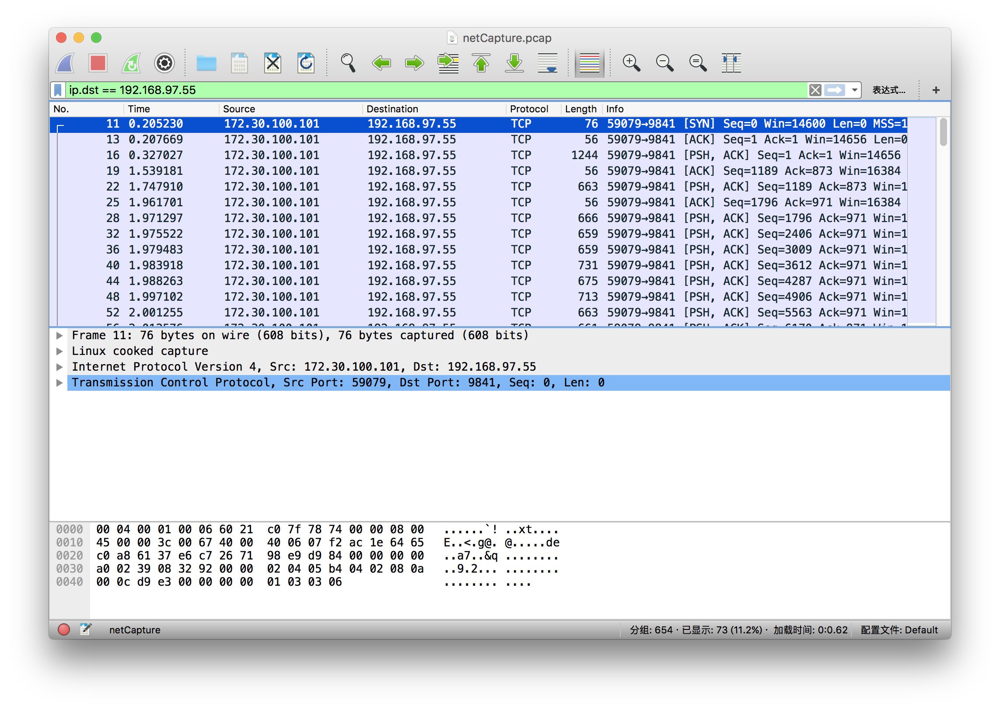

## 背景

在实际使用过程中遇到需要抓取移动设备的 socket 包，之前一直是采用 Charles 抓取 http/https 包，对 socket 的需求没有那么强烈，但是终究还是遇到了，于是记录一下抓取过程，后面方便自己查看。（实际上从遇到动手实施之后到写下博客，我已经忘了怎么实现的了，脑子不好，掩面逃走）

## 要求

Android 已 root 设备一台

[tcpdump](http://www.androidtcpdump.com/) 工具一枚

[Wireshark](https://www.wireshark.org/) 工具一枚

## 实现

### 把 tcpdump 上传到手机上

```bash
adb push tcpdump /sdcard/data # 上传 tcpdump
adb shell # 登陆 adb shell
su # 提权为 root
cp /sdcard/data/tcpdump /data/local/ # 将 tcpdump 拷贝到 /data/local 目录下
chmod 777 /data/local/tcpdump # 修改 tcpdump 执行权限
```

### 运行 tcpdump

```bash
# 将抓到的包输出到 netCapture.pcap 文件中
/data/local/tcpdump -i any -p -s 0 -w /sdcard/data/netCapture.pcap
```

**参数介绍**

* -i: 指定监控的网络接口, any 表示监控所有端口.
* -p: 将网络接口设置为非“混杂”模式.
* -s: 指定抓取网络请求返回的大小,0 表示抓取整个网络包.
* -w: 指定数据包写入文件的位置.

更多关于 tcpdump 的介绍可以查看[这里](https://www.cnblogs.com/ggjucheng/archive/2012/01/14/2322659.html)

### 导出 netCapture.pcap 到 PC 上

```bash
adb pull /sdcard/data/netCapture.pcap ./
```

### 使用 Wireshark 查看包

在 Mac 下直接双击 `netCapture.pcap` 文件就可以了。

如图：



因为笔者是为了找客户端发出去的包，所以在筛选条件加入 `ip.dst == 192.168.77.55` ，如果想查看收到的包可以加上这个，即 `ip.dst == 192.168.77.55 or ip.src == 192.168.77.55` ，然后查找到对应的 `[PSH, ACK]` 开头的包就能找到客户端有发送出去的包了。

三次握手四次分手 TCP 协议的介绍可以看这里：[通俗大白话来理解TCP协议的三次握手和四次分手](https://github.com/jawil/blog/issues/14)

## 后记

了解一些关于抓包的技巧对于定位网络问题还是有一定帮助的，特别是用于理解底层协议也有帮助，通过这个也可以清楚的看到收到什么，发出去什么，这个是没办法骗你的。

希望对你有帮助，祝生活愉快！

