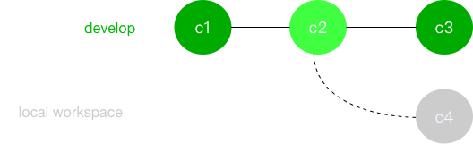
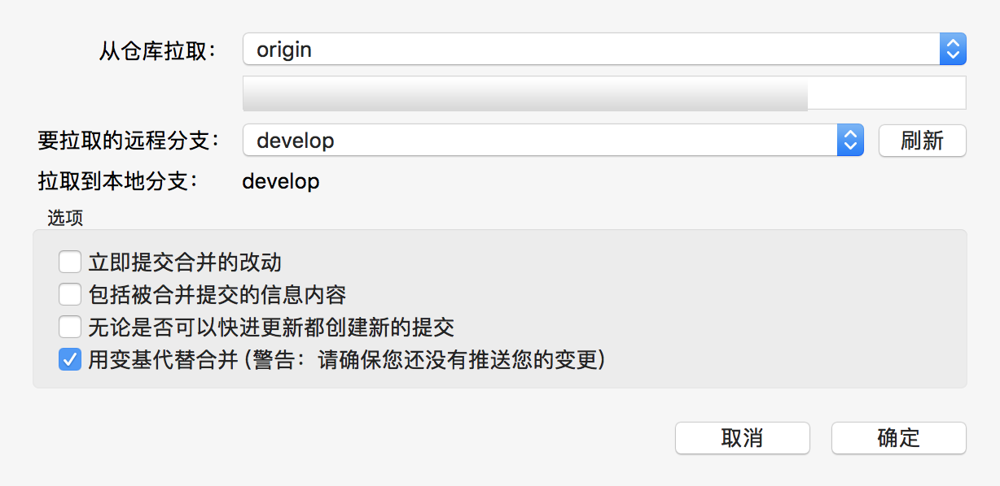
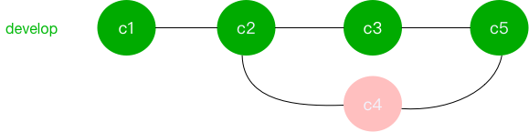
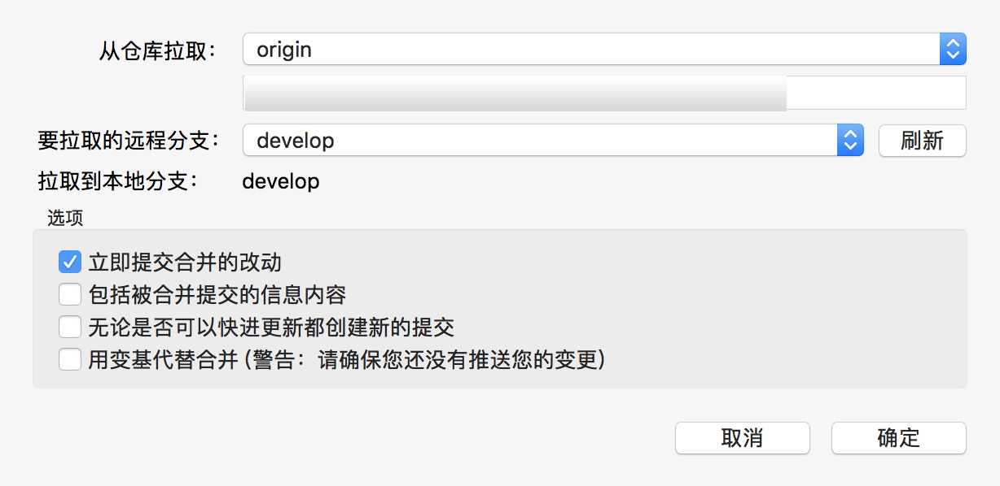
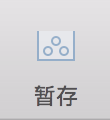

## 问题来源

从 SVN 切换过来的都是习惯 SVN update，然后 commit 就好了，但是切换到 Git 之后，发现我想更新都不可以，这是什么事？

Git 不同于 SVN 就在于你操作的本地文件（版本控制中）有修改，那么你需要对他进行安置（操作）才可以更新，不像 SVN 每次直接 `update` 再 `commit` 就好了，Git 需要 **action** 本地再进行 **update**，所以每次都很懵逼，但是一旦你习惯了，其实也没那么复杂，无非就是手法不一致而已。

## 操作

在操作之前，建议先获取(fetch)一下更新，查看最新的状态再进行操作。

### **本地提交法**

如图：

C2 是我们当前的节点， C4 是我们本地修改并提交的，这个时候， develop 分支上有一个新的更新，我们想拉取下来。

* 变基／衍合（rebase）【 recommend 】
采用这种形式的话，我们可以保持主线的单一性，线条看起来更好看，操作之后会变成这样。

操作：

如果确实要修改，推送上去就可以了。

_注： rebase 发生在我们本地有未推送的情况下，操作过程中如果有冲突，我们要先解决完冲突然后再继续 rebase 就好了。_

* 合并（pull）

采用这种方式的话，我们的 develop 会显示一个合并节点，当然这种也没有什么错，只是太多的合并，看起来不是特别美观，所以还是用上面的方式吧。

操作：

### **暂存大法**

除了上面的需要提交的方式，有时候我们不想提交自己的代码，那么这个方式适合你。利用 **暂存**，让你的代码存储在另外一个空间，这样就可以**拉取更新**然后再**应用贮藏**回来就可以了。

记住这个按钮，你会喜欢上他的。

注：暂存只会存有版本控制的文件，新增且未加入的不会

### **子模块更新**

因为我们项目添加了一个子模块，所以更新的时候优先到**子模块**更新，然后再到**主项目**下更新。
有的小伙伴现在主项目更新，结果子模块被强制设到索引去了，导致代码丢失，这个就很悲剧了。

## 总结

好了，今天的 Git 小课程结束，希望有对你产生帮助。
