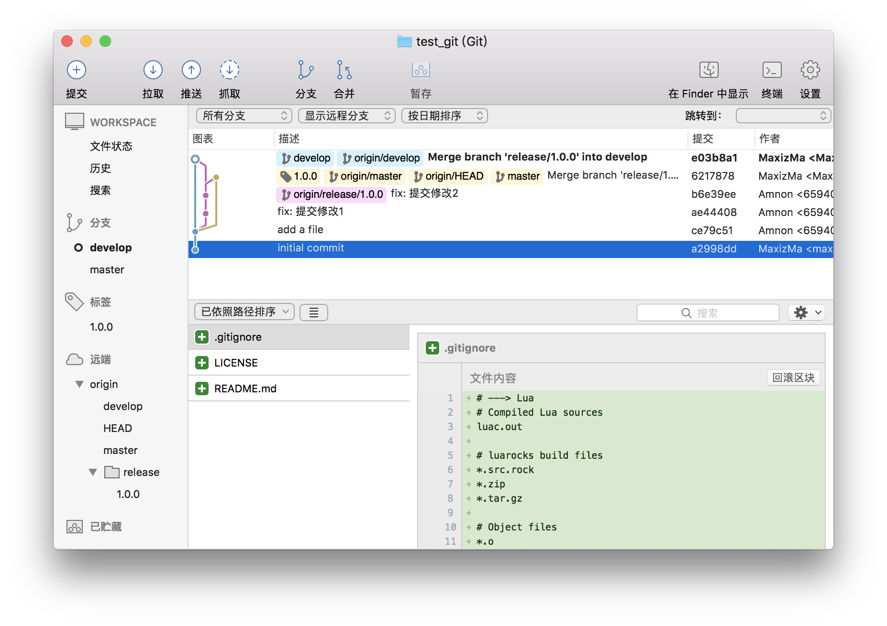
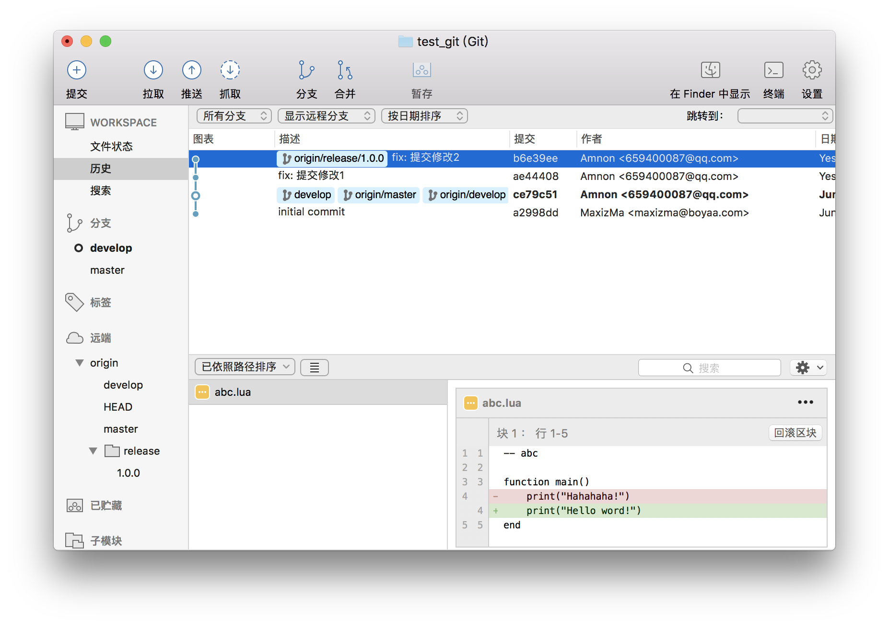

## 前言

项目开始推 Git 作为代码管理，然后因为其他同事不是特别了解 Git 的操作流程，特别是在 GitFlow 工作流程下，更容易出现误操作，比如直接在 master 上提交更新，合并出错等等。

## 删除远程提交操作

这种强制撤销远程 Git 提交理论上是**不推荐**使用的，比较推荐**提交回滚**，所以 sourceTree 上没找到对应的操作方法，但是强迫症受不了，于是找了一下，行之有效的方法。

假设最近你的提交有：

    commit 3
    commit 2
    commit 1

其中最后一次提交 **commit 3** 是错误的，可以执行

```bash
    git reset --hard HEAD~1 
```

此时, **HEAD is now at commit 2**, 然后再使用

```bash
    git push --force
```

将本次变更强行推送至服务器。这样在服务器上的最后一次错误提交也彻底消失了。

**注意：** 这类操作比较比较危险，例如：在你的 **commit 3** 之后别人又提交了新的 **commit 4**， 那在你强制推送之后，那位对应的 **commit 4** 也跟着一起消失了。

## 撤销合并

假设我们出现如图这种情况：



这种情况是我们项目完成 release 版本发布了，然后发现，坑爹的，还有代码没有提交，需要撤销一下我们的操作。
注意： 此时的 **release/1.0.0** 这个分支还存在，如果已经删除了，不好意思，还是别做额外的操作了，麻烦。

好了，要撤销分支的提交的话，需要这么操作：

```bash
    git checkout master
    git reset --hard HEAD~1
    git push --force
    git checkout develop
    git reset --hard HEAD~1
    git push --force
    git tag -d 1.0.0
    git push origin :refs/tags/1.0.0
```

这个时候，我们的提交就变成这样了：



下面就继续做你的改动吧，然后再提交就可以了。

原理同上面操作是一致的，需要分别在对应的分支上重置会上一个状态。

如果有其他关于撤销分支的内容可以参考这里： [undoing-merges](https://git-scm.com/blog/2010/03/02/undoing-merges.html)

**注意**：操作不可逆，请谨慎操作，重置的时候记得切换到对应的分支上操作。

