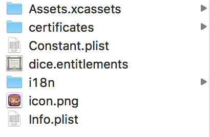

## 背景

没有实际躺过坑，就无法知道深浅，过去一直以为就算其他什么也不懂，但只要查找一下资料，还是可以很快入门的，但实际操作起来，别人一两小时可以搞定的东西，你或许还是要花费 1-2 天才能正确实施，当然，我把这个划分到学习成本里面吧，慢慢积累和收录一些过程中的问题，我相信，以后也可以更快的开发。

## 三两问题

### 如何入门 iOS

* 概述

60 分钟就能入门，你信不信，反正我不信，那你看看怎么样？[iOS开发60分钟入门](https://github.com/qinjx/30min_guides/blob/master/ios.md)

* 开发语言 [Objuct-C](https://zh.wikipedia.org/wiki/Objective-C)

工欲善必先利其器，连用什么开发语言都不懂的话，那不是很悲哀，正好之前浏览过一个网站，如何在 X minutes 下学习 Y，刚好拿来用用，也是英文不好，但也只能硬着头皮啃。这里传送： [Object-c](https://learnxinyminutes.com/docs/objective-c/)

* 开发工具 [Xcode](https://zh.wikipedia.org/wiki/Xcode)

### iOS icon 尺寸要求

以前只知道 iOS 发布的时候，需要给一套 icon，但其实不清楚有哪一些，以前注意点是什么？我觉得这样的问题不止我有，其他人肯定也有，所以一些聚合性的网站就帮你收集了相关的知识点，好人呀。

看看[官方文档](https://developer.apple.com/library/content/qa/qa1686/_index.html)，**官方永远是权威的，不要质疑!**

作为懒人肯定是想偷懒的，所以如何快速输出对应尺寸的图片也是要知道的。

首推[图标工场](http://icon.wuruihong.com/)，一键生成你需要的所有尺寸，简单粗暴。

PhotoShop 通过脚本生成对应尺寸，将下面的内容保存为 `.jxs` ，通过 Photoshop 运行即可，定制性更强，以后可以自己动手。

```jxs
#target photoshop
app.bringToFront();

var sizeList =
[
    {"name": "iTunesArtwork",        "size":512},
    {"name": "iTunesArtwork@2x",        "size":1024},
    {"name": "Icon",                      "size":57},
    {"name": "Icon@2x",                "size":114},
    {"name": "Icon-@2x",               "size":114},
    {"name": "Icon-40",                  "size":40},
    {"name": "Icon-72",                  "size":72},
    {"name": "Icon-72@2x",            "size":144},
    {"name": "Icon-Small",              "size":29},
    {"name": "Icon-Small@2x",       "size":58},
    {"name": "Icon-Small-50",         "size":50},
    {"name": "Icon-Small-50@2x",  "size":100},
    {"name": "Icon-50",                  "size":50},
    {"name": "Icon-57",                  "size":57},
    {"name": "Icon-58",                  "size":58},
    {"name": "Icon-72",                  "size":72},
    {"name": "Icon-76",                  "size":76},
    {"name": "Icon-80",                  "size":80},
    {"name": "Icon-100",                "size":100},
    {"name": "Icon-120",                "size":120},
    {"name": "Icon-144",                "size":144},
    {"name": "Icon-152",                "size":152},
    {"name": "Icon-29",                 "size":29},
    {"name": "Icon-29@2x",                "size":58},
    {"name": "Icon-29@3x",                "size":87},
    {"name": "Icon-40@2x",                "size":80},
    {"name": "Icon-40@3x",                "size":120},
    {"name": "Icon-60@3x",                "size":180},
    {"name": "Icon-60@2x",                "size":120},
    {"name": "Icon-76",                "size":76},
    {"name": "Icon-76@2x",                "size":152}
];
//尺寸集合
// var sizeList = [1024,512,192,180,152,144,128,120,114,100,96,87,80,76,75,72,66,60,58,57,50,48,44,40,36,32,29,16];

//任意一个宽与高相等的图像，尺寸大于1024x1024像素。
var fileRef = File.openDialog ("请选择一个文件", "*.png", false);

//也可以在这里直接定义一个输出文件夹，Folder.selectDialog("然后选择一个输出文件夹");
//我这里直接使用被选择图片的相同目录
var outputFolder = fileRef.parent;

//打开文件
var activeDocument = app.open(fileRef);


var destFolder = Folder.selectDialog( "请选择一个输出的文件夹：");

//运行批处理尺寸
runNow();

function runNow()
{
    if(activeDocument.height != activeDocument.width)
    {
        alert("当前文件宽高尺寸不一致，脚本已中止。");
        return;
    }

    //  if(activeDocument.height < 1024)
    //  {
    //      alert("选择的原始图像尺寸必须大于等于1024x1024像素。");
    //      return;
    //   }


    for(var i = 0; i < sizeList.length; i ++)
    {
        //重置图像尺寸
        activeDocument.resizeImage(UnitValue(sizeList[i].size,"px"),UnitValue(sizeList[i].size,"px"),null,ResampleMethod.BICUBIC);

        //图像无论是放大还是缩小，都会变模糊，只是放大时模糊的快一些，缩小时模糊的慢一些
        //所以这里复制一个图像进行锐化，可以让缩小后的图像清晰一点。
        var duplicateLayer = activeDocument.activeLayer.duplicate();

        activeDocument.activeLayer = duplicateLayer;

        duplicateLayer.applySharpen();//应用锐化
        duplicateLayer.opacity = 40;

        activeDocument.flatten();//合并图层


        var destFileName = destFolder + "/" + sizeList[i].name +".png";

         if (sizeList[i].name == "iTunesArtwork" || sizeList[i].name == "iTunesArtwork@2x")
             destFileName = destFolder + "/" + sizeList[i].name;

        //保存的文件
        var saveFile = new File(destFileName);

        //如果文件已经存在就先删除它
         if (saveFile.exists)
         {
               saveFile.remove();
         }

        //以 PNG 格式保存，带压缩
        var pngSaveOptions = new ExportOptionsSaveForWeb();
        pngSaveOptions.format = SaveDocumentType.PNG;
        pngSaveOptions.transparency = true;
        pngSaveOptions.includeProfile = false ;
        pngSaveOptions.interlaced = false ;
        pngSaveOptions.PNG8= false ;

        activeDocument.exportDocument(saveFile, ExportType.SAVEFORWEB, pngSaveOptions);

        activeDocument.activeHistoryState = activeDocument.historyStates[0];//还原到打开状态
    }
    activeDocument.close(SaveOptions.DONOTSAVECHANGES);//原始被打开的文件不保存，关闭源文件
}

```

### 如何在沙盒中读取和写入图片？

1. 保存图片

```object-c
// 首先,需要获取沙盒路径
NSString *path = [NSSearchPathForDirectoriesInDomains(NSDocumentDirectory, NSUserDomainMask, YES) lastObject];
// 拼接图片名为 "currentImage.png" 的路径
NSString *imageFilePath = [path stringByAppendingPathComponent:@"currentImage.png"];
// 获取网络请求中的 url 地址
NSString *url = [dataDic objectForKey:@"IndexUrl"];
NSData *data = [NSData dataWithContentsOfURL:[NSURL  URLWithString:url]];
// 转换为图片保存到以上的沙盒路径中
UIImage * currentImage = [UIImage imageWithData:data]; 
// 其中参数 0.5 表示压缩比例，1 表示不压缩，数值越小压缩比例越大(到一定程度之后就没有效果)
[UIImageJPEGRepresentation(currentImage, 0.5) writeToFile:imageFilePath  atomically:YES];
```

2. 读取图片

```object-c
// 借助以上获取的沙盒路径读取图片
NSString *imageFilePath = [path stringByAppendingPathComponent:@"currentImage.png"];
```

* 如何合理的压缩图片？

正常情况都很少需要压缩图片，但是在使用第三方 SDK 做分享的时候，人家对你的图片就有要求了，这个时候就需要对你的图片进行修饰一下了，如何最大程度保证图片的质量最快的压缩图片就是这里要讲的。

压缩图片的方法：
- 压缩质量
- 压缩尺寸

区别：
压缩图片质量的优点在于，尽可能保留图片清晰度，图片不会明显模糊，缺点在于当图片质量低于一定程度时，继续压缩没有效果，所以不能确保压缩后的大小；

压缩图片尺寸可以使图片小于指定大小，但会使图片明显模糊(比压缩图片质量模糊)。

下面的代码就是围绕这两个来进行操作的，优先压缩质量，达不到要求在缩放图片尺寸，并使用二分法减少循环次数。

翠花，上代码：

```object-c
+ (UIImage *)compressImage:(UIImage *)image toByte:(NSUInteger)maxLength {
    // Compress by quality
    CGFloat compression = 1;
    NSData *data = UIImageJPEGRepresentation(image, compression);
    if (data.length < maxLength) return image;

    CGFloat max = 1;
    CGFloat min = 0;
    for (int i = 0; i < 6; ++i) {
        compression = (max + min) / 2;
        data = UIImageJPEGRepresentation(image, compression);
        if (data.length < maxLength * 0.9) {
            min = compression;
        } else if (data.length > maxLength) {
            max = compression;
        } else {
            break;
        }
    }
    UIImage *resultImage = [UIImage imageWithData:data];
    if (data.length < maxLength) return resultImage;

    // Compress by size
    NSUInteger lastDataLength = 0;
    while (data.length > maxLength && data.length != lastDataLength) {
        lastDataLength = data.length;
        CGFloat ratio = (CGFloat)maxLength / data.length;
        CGSize size = CGSizeMake((NSUInteger)(resultImage.size.width * sqrtf(ratio)),
                                 (NSUInteger)(resultImage.size.height * sqrtf(ratio))); // Use NSUInteger to prevent white blank
        UIGraphicsBeginImageContext(size);
        [resultImage drawInRect:CGRectMake(0, 0, size.width, size.height)];
        resultImage = UIGraphicsGetImageFromCurrentImageContext();
        UIGraphicsEndImageContext();
        data = UIImageJPEGRepresentation(resultImage, compression);
    }

    return resultImage;
}
```

引自： [iOS 图片压缩方法](http://www.cnblogs.com/silence-cnblogs/p/6346729.html)

这里还有另外一位小伙写了一个相对比较全的方法，但在使用中遇到返回结果有异常的情况，还没有深入去剖析，不过思路跟上面一样，定制性更好，可以看看然后综合一下。看这里：[UIImage 二分压缩图片](http://www.colinhwang.com/2016/07/30/compress-image/)

### 使用 target 解决一套代码多个 App 问题

先上一些过程中找过的几个教程，后续再来做一下总结。

[猿题库iOS客户端的技术细节（一）：使用多target来构建大量相似App](http://blog.devtang.com/2013/10/17/the-tech-detail-of-ape-client-1/)
[iOS - 创建大量相似App的另外一种选择](http://blog.startry.com/2015/09/06/Optional-solutions-for-iOS-multi-target/)
[Xcode:用于管理多个 target 配置的 XCConfig 文件](http://swift.gg/2015/12/01/xcode-xcconfig-files-for-managing-targets-configurations/)

对比了几个，我发现目前我需要的还没有到他们使用的那么复杂，于是我只是简单的 duplicate 一下我的 target 然后就 over 了。

首先我梳理了目前项目中各个相似 App 的不同之处，汇总起来大概有这么一些。



包含了几个内容：

* icon 和 图片资源
* 国际化
* 证书
* 开发调试
* 配置文件

操作步骤：

1. 在 `TARGETS` 下 选中 `projectX（你自己的项目）` 右键 `Duplicate` 然后选择 `Duplicate(only)` 复制一个新的 target
2. 回车修改名字
3. 同时修改 scheme 名字 `scheme -> manager scheme -> 选中回车修改`
4. 删除默认的 `projectX copy-Info.plist` 文件
5. 在项目文件路径下（`runtime-src -> proj.ios_mac -> ios -> verCustom`）准备好当前版本的资源
    * 新建新游戏名字目录
    * 从其他项目下 copy 内容到当前目录
    * `Assets.xcassets` 是 icon 的集合，按照规格替换 icon
    * `i18n` 多语言国际化，主要替换 display name
    * 在 `certificates` 下准备好新的证书
    * `Constant.plist` 配置 API
    * `xx.entitlements` 这个文件在修改权限的时候会生成（比如推送，支付），考虑到以后不同版本可能会不同，所以每个订制一个
    * `icon.png` 152*152 的 icon 文件
    * `Info.plist` 配置文件
6. 在 `Xcode` 下导入刚才添加的文件（ **add files to X** ），用于后续配置 target 时使用
7. 选中当前 `target` ，在 `General` 下选择新的 `Info.plist` 文件，修改 `Identity` 的相关信息
8. 在 `Info` 下修改 Bundle Name, FacebookAppID, FacebookDisplayName, `URL Types` 下修改 `URL Schemes` 
9. 在 `Build Settings` 修改 `entitlements` 的路径
10. 在 `Build Phases` 下，修改 `Copy Bundle Resources` ，移除没用的资源，把当前版本需要的添加进来

这样配置完，需要修改的东西集中了，运行的时候也很好操作，避免了没次频繁的打开项目。

当然看完上面的之后，你肯定就会想如何更好的管理，最好是连配置和修改这个过程都省略了，自动化到一定程度之后，就会带来另外一个问题，你连操作都不用的话，需要改动到里面相关内容的时候，你还是需要把你欠下来的补回去的，出来混，迟早是要还的。

### 脚本打包，你知道么？

未来补充上我之前定制好的一个一键打包脚本。先占坑。
用 Xcode 打包有时候挺方便的，但有时候也会挺麻烦的，比如你自己的测试机，好，那么连接 Xcode 很快就能调试测试，但假设你要输出包给其他人呢？或者打多个包呢？

刚才引申出来，其实我们要解决两件事：
1. 自动化打包
2. 架设「包管理」 服务器（下面讲）

本着拿来主义原则，先看看友人们是如何解决这样的问题的。

参考：[Xcode 8 后的自动打包脚本](https://juejin.im/post/58fea6435c497d00580d249d)

好了，再来看看我这边的一套代码吧，虽然简单，胜在有用。

[iOS 自动打包脚本](https://github.com/Maxize/Blog_demo_list/tree/master/iOS/IPA_Packer)

**注：打包脚本建立在 Xcode 上已经可以输出对应不同的包的基础上**

### 架设包管理服务器

关于这个我也没有实际操作过，但我知道有这么一回事，以后可能也会尝试一下，目前来说需求不是特别大，之前公司大可能有，现在来说虽然各位老板都是用 iPhone ，但证书要不起呀。

有兴趣的参考一下这个： [Mac OS X 10.10.2 启用 Web 服务器
搭建企业内部自己的app OTA](https://www.15yan.com/story/17xhoqjJfUO/)

当然没钱的看官可以采用其他云服务器提供的服务打包上传：[iOS如何部署企业包，以供他人下载](http://www.jianshu.com/p/a9db64b53607)

### 设计师都看的，你看不看？了解设计规范，分辨率分布，你也可以很设计师。

最近想重新思考一下分辨率适配，发现对分辨率的一个分布其实没有一个总体的概念，于是就想找一下哪里可以比较全面的看到市场上的分辨率集中在什么尺寸，[这个网站「屏幕尺寸大全」](https://uiiiuiii.com/screen/index.htm)也是偶然得之，我最粗暴的方法是通过友盟看线上已跑的项目主要的设备分辨率。这个后续我整理一个文档输出一下，有兴趣的可以查看，主要涵盖国内和泰国地区。

于是在这里也看到了关于不同平台的设计尺寸规范，感觉很有用，就收录了下来，以后可以经常去翻阅，回味一下。[iOS 设计尺寸规范](https://uiiiuiii.com/screen/ios.htm) 与 [Android 设计尺寸规范](https://uiiiuiii.com/screen/android.htm)。

一次可以跟设计师有共同话题的机会，你抓住了么？

## 总结

小白遇到的问题肯定都是很低级的，所以高手就绕过吧。

哪一天再回来看的时候，我也可以骄傲的说，咱也是从菜鸟慢慢变成老鸟的，不信你看，这都是经验。
