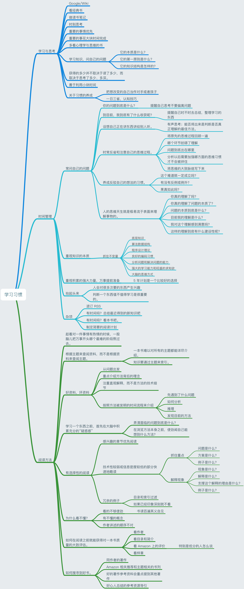

## 前言

最近发现自己之前定下来的一些目标都没有去实现了，因为这样那样的问题，回想之前在翻看刘未鹏博客的时候，对于他的一些思考方式和学习习惯印象深刻，但具体也记不得了，为了更好好的借鉴和参考，于是重新看了一下，并记录下来。

总结自己的问题：

1. 焦虑
2. 注意力不集中
3. 有一些坏毛病
4. 主次不分

带着这些问题，然后重新看了「一直以来伴随我的一些学习习惯」[一](http://mindhacks.cn/2008/09/17/learning-habits-part1/) [二](http://mindhacks.cn/2008/09/17/learning-habits-part2/) [三](http://mindhacks.cn/2008/09/17/learning-habits-part3/)，记录了下面这张思维导图，给有需要的也一起看看，共勉吧。

## 内容

## 总结

方法了解的再多，不实践都是空的，无用的。好的用户习惯总是难以养成，这个是长久以来身体最诚实的选择。做什么除了觉悟还有就是坚持，坚持，再坚持！

希望自己可以变得稍微看的顺眼一点。

最近我也想去做个 5 年计划了。
