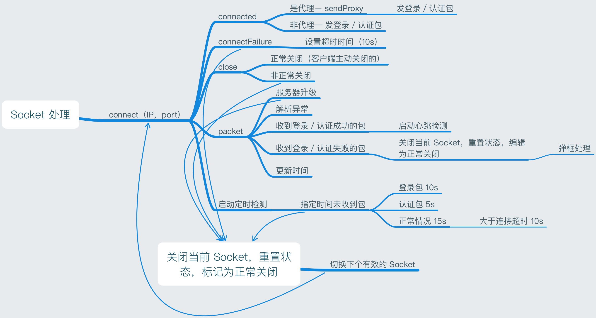

## 背景

做网络游戏开发的过程中多多少少会遇上点事，有时候一些问题因为自己的知识匮乏而变的莫名其妙，而也是在这个过程中也是重新认识这个知识的好机会，而这篇文章，我打算记录一下我曾经遭遇过的一些网络问题。

## 问题集锦

### Socket 丢包问题？

**先说结论，理论上基于 TCP 协议是不存在丢包问题的。**

为什么这么说，因为 TCP 协议的定义就是这样说的，一种面向连接的、可靠的、基于字节流的传输层通信协议，由 IETF 的 RFC 793 定义。

而可靠的意思就是基于**校验和**来**确认和重传机制**来保证可靠传输，如果存在网络不可达或者网络弱的情况，TCP 是会告诉用户，有东西没发送成功，我要中断连接了。

所以从这个角度去考虑，在 TCP 层，不存在丢包问题，那么为什么还会有丢包的问题存在呢？这一块我们之前也做过分析，也吃过不少苦头。这里就猜测一下，仅个人见解。

总结起来，我觉得最主要的问题就是**应用层封装的网络模块处理逻辑导致的丢包**。

偏底层的解释就是 Socket 在处理**粘包**的时候抛弃了，这一块可以做点文章，避免这种情况，我说一下一种有效解决的思路，**对所有的包／部分重要的包约定重传。**而我们之前的 Socket 模块封装的时候对这一块的处理就是，抛弃了。

后面自己封装前后端协议的时候对这个问题的理解才慢慢深刻起来。

Socket 在处理收发的时候一般都会采用缓冲区，而在处理缓冲区的时候就会出现多个包在一起或者一个包被拆成多个的情况。出现丢包就是这一块的逻辑没处理好引起的，我们协议定义的时候都会把每个包的长度放在协议头，采用这个来确保可以正确的读取整个包的内容，**但如果存在半个包的情况的话，会缓存起来，等待下个流过来，而恰好就是下个流迟迟未来，而来的不是刚好对应的那个包（网络拥塞引起的）那么这边要处理新包，就把那半个包扔了。**一丢就会造成下个半包读取有问题，连锁反应知道下个有完整长度的包过来。关于粘包的问题可以看看这个，[Socket/TCP 粘包、多包和少包、断包](http://www.jianshu.com/p/84aed2dfcb31)

这种是由于不稳定的网络引起的，所以如果是这个问题，**应用层可以针对包的重要程度考虑是否从应用层通知 Server 重新发送这个包。**

偏上层的解释是其实 Socket 断了，但包已经从服务器发送出去了，重连回来之后没有重新确认（很多时候都不会处理）导致在断线期间的所有包都丢了，重连的时候一些关键信息遗漏了。解决这一类问题比较偷懒的做法就是关键信息都在重连包里面重新设置一遍。这个问题在我们处理的时候往往忽略了。

## 通过心跳检测还是通过 Socket 事件来处理 Socket 连接问题？

**先说结论，目前我会采用以 Socket 事件为主，心跳为辅的方式来处理 Socket 连接的问题。**

再说说背景，之前因为没有好好捋清楚我们这边提供的 Socket 模块的相关逻辑，导致出现在连接异常的时候（收发包异常）而采用重新建立 Socket 连接，而收到 Close 事件的时候也进行重连，导致一个问题，出现多条 Socket 同时连接，或者重连时出现打开 Socket 发现还有 Socket 未关闭。

自我总结一下这一块问题，有两个点。

1. 没有捋顺逻辑的影响就是处理过于混乱
2. Socket 的 open 和 close 都是异步的

先记录问题，等会再说解决方案。

然后就想，那要不就只用心跳来检测好了，但是后面发现了两个问题是因为纯心跳检测引起的。

1. 检测时间过长，导致不能及时响应。 （30s 才能知道结果）
2. 在有代理的服务器上，心跳检测是正常的但是却没有正确的连接上 Server

通过上面的问题，回过头再来看如何设计一个更好的 Socket 处理逻辑就很明显了。

首先讲一下 Socket 的几个事件，连接成功，连接失败，关闭事件，收包事件（正常收包，收包异常）。那么什么情况会返回这些事件也要清楚。

1. 连接成功
    - 这个比较容易理解，连接成功就会收到
2. 连接失败
    - 一般情况都是服务器不可达，触发了本身的超时，或者网络不可用（Wi-Fi 有信号无网络连接）
3. 关闭事件
    - 可以是客户端主动断开，也可以是服务器主动断开，也可以是网络中断（比如利用工具 TCPView 强制关闭 Socket，客户端发送一个 RST 的包给服务器）
4. 收包事件
    - 这个就是我们正常的解包事件，同时也包含解包错误的情况

单纯靠事件来检测貌似也是可以很及时的处理 Socket 的连接问题了，但是有时候连上的 Socket 不是业务 Server 的时候，这些事件都正常，你给服务器发包它不会回你，那么怎么解决呢？

是的，需要一个业务心跳包来辅助。

汇总一下是下面这张图，心跳检测通过在 Socket 事件中通过时间值来通知是否需要中断就好了，这样只需要启动一个检测就好了。



* 注：
    - 登录／认证包是为了提高连接上服务器效率而存在的，如果偷懒，直接采用登录包就好了
    - 启动心跳包，只在登录成功之后开始，且模块独立，只需要管什么时候发送或者关闭就好
    - 关闭的时候，正常的不需要额外处理，因为客户端主动关闭的之前要么就是异常导致了，或者就是要关闭 Socket，一般也会有对应的 Open 事件
    - 定时检测也是在 Socket Open 的时候就开始

异常的时候，由 Socket 的事件来驱动，正常的时候通过业务心跳来驱动，理论上可以很好的处理各种问题。

上述问题不包括的有：设备切换前后台，Socket 事件要怎么处理，如果有 Socket 包堆积，是否要处理，（如果处理，设备在回到界面的时候因为多个消息同时到来，动画或者什么会跟放电影一样），open／close Socket 的时候采用异步，那么就需要对 Socket 进行业务的区分，一些时间的设置可以动态调整，目前只是一个参考。

## 弱网问题有何良计？

**结论先说，一旦网络有问题，做什么都无法改善，所以省点心吧，但一旦网络稳定了，你要快速的帮客户端连上。**

既然结论都说死了，那还有什么意义呢？

这里其实还是要分情况的，弱网有一个比较突出的表现，那就是高延迟，一种是包太大了，一种是包很小。前者的话可以通过压缩数据，减少包体积来解决，后者，不好意思，网络的问题，我做什么都难以有效。

如果你相信 TCP 的话，那么它其实是为了给你完整的数据，他是一只在给你拼命尝试重传包的，除非换掉 TCP ，不过这样的难度比较大，有兴趣的可以了解一下 [KCP](https://github.com/skywind3000/kcp)

回到刚才的问题，我们模拟一个场景，如果你进入到电梯里面，网络不好了，这个时候其实可能只是延迟高一点而已，但是升降了几层之后，网络完全没有了，那么是你，该如何在用户离开电梯之后让其更快的回到游戏呢？

1. 尽可能让双方传输的网络包小
    - 可以采用 gzip 压缩
    - 多用缓存数据
2. 尽可能的重试
    - 断网了你要第一时间知道，并进行多次尝试，必要的时候可以让用户帮忙
3. 没必要的结果就不要通知用户了，用户比你想象的聪明
    - 之前我们就是很多消息都告诉用户，其实用户只关心结果
4. 体验优先
    - 网络卡了，不要让用户什么都操作不了，没有什么比这个更糟糕了
    - 就算包没发出去，但是对应的动画可以先播放
5. 提供更优质的网络链路给客户端
    - 通过给不同地区不同运营商的用户提供延迟最低的高速通道
    - 依赖大数据分析

好吧，这是我的结论和方法，不知道能不能帮到你，在游戏上线前最好还是做一下弱网测试，一方面，可以知道自己的游戏能在什么环境下流畅运行；另一方面，弱网检测可以发现不少原来在正常网络下无法发现的问题。

## Socket 缓冲区设置过小导致无故关闭问题？

**先说结论，64K 是 TCP 能传输的最大包大小，可以试试。**

之前我们游戏在一个场景下出现 Socket 断开了，之后就连不上了。查了好久都没有发现什么问题，一开始 Server 在应用上层，打各种日志，无果，最后开始操刀底层的处理逻辑，发现在服务器发大量包的时候容易出现 Socket 断开的情况，而客户端也是要进行多次相同操作才会出现（60 次左右吧），这是要有多蛋疼才会对同一个网络请求进行这么多次的尝试，我们公司的测试就会。

最后定位到这个问题是因为 Server 设置缓冲区的时候设置过小（20K），而在需要发送大量数据的时候缓冲区一下子就被填满了，导致溢出，Server 强制断开 Socket，然后客户端又重连，然后 Server 再发送大量数据填充缓冲区，如此反复，客户端就连不上了，Server 也没有把数据发送出去。

后面 Server 把缓冲区设置到 64K 才解决，当然这也是解决了 20K 缓冲区的问题，但是 64K 的问题依然没有解决，记得没错的话， TCP 协议的滑动窗口大小也改了。

## Server 没有收到客户端发送的协议，这不科学？

**结论，在可靠网络协议下，Server 没有收到包，那是你客户端根本就没有发送成功，还是看看代码吧，少年。**

背景，之前我们遇到过一个莫名其妙的问题，在手机上关闭网络之后，回到登录界面，重新连接网络之后进到原来的场景下，能收到包，发不出任何包了。

当时拿到这个问题的时候也是一脸懵逼，无从下手，一开始打日志查看上层逻辑，也发现客户端有发包，Socket 也没有断开，而 Server 却说没有收到客户端发送的包，包让「旺财叼走了」？

好吧，使出大招，我用 WireShark 抓包，我抓包看看，如果客户端真的把包发出去了，我毙了那 Server。激动了。

而通过抓包发现，包确实是有发的，只是没有发送出去的，我忍住操家伙的冲动找了一下我们公司封装 Socket 模块的哥们，把抓到的 Socket 包和客户端日志发给他看，看看为啥客户端发包了，但包没有到达网络层。

有一个日志是我这边忽略的，那哥们一下指出来并定位这个日志出现的条件，socket 没有连接上。

```bash
socket: write begin non-connected
```

后面重新梳理一下客户端逻辑，客户端底层在网络断开的时候会进行多次尝试，而每次重连，我们这边会让 Socket 的名字累加，Socket_1，2，3，... 而重连回来的时候收包的 Socket 复用的是 Socket_xx 了，而发送用的还是 Socket_1，收和发都不是同一个，怎么可能处理的了呢？

最后处理的解决方案就是在回到登录界面的时候清楚 Socket 引用，在处理 Socket 连接那块把 Socket 引用对象删除，只是两行代码，而实际解决却花了 2 天。

把这个问题拿出来说就是为了提醒各位客户端大大们，在定位问题的时候，除了我们尽可能要做的尝试之外，还要**忍住，忍住，静下心，静下心**，一切莫名其妙的问题最后可能就是很傻的一个错误导致的，不过奇怪的是，这个复现路径也不复杂，为什么之前没有暴露出来呢？

## 防攻击该怎么办？

做网络游戏不可避免的问题就是如何防止 DDoS 攻击呢？

**结论，钱要多，咱就不怕事！**

之前跟同事聊起这个问题，他说他们公司因为这个问题导致服务器瘫痪了几天，导致公司日活在服务器正常的时候掉了一半，当时他们老板也知道了肯定是竞争对手搞的。

而 DDoS 攻击的问题确实无解的问题，所有的客户端连接都是有效的，只是架不住那么多并发呀。

上次刚好重温了一下关于三次握手的时候，里面也提到这个，所有的请求只进行一次握手，服务器回应之后等待客户端发确认包过来，而处于等待状态（超时没有回应会断开），而占用了服务器资源。然后攻击者换另一台客户端继续操作，如此反复导致大量的服务器资源被占用，而正常的服务就不能进行。

我不清楚现在这个还是否存在，有一个提到的解决方案是服务器主动发包给连接的一端，如果没有回应就直接断开，避免资源浪费，当然我理解 DDoS 之所以成为世界难题，肯定还是架不住大量的肉鸡发起的海量请求。

那么如何在 DDoS 来的时候不要太被动呢？

1. 找一个靠谱的运营商
2. 跟 DDoS 攻击者进行游击战

这里的两个操作都是需要资金支持的。靠谱的运营商能提供这种服务的，费用肯定也是不低的，而运营商能做到的也只是相对的，比如你随便的运营商 1s 可以承受 10G 的流量，而高价格的可以承受 200G 的流量并且会帮你过滤正常的流量，一旦超过了，依然会让你的网络降下来，然后再加上服务端代码写的不咋地，实际上一来就不行了。

如果是按照流量算钱的，那么我想快哭晕了。

跟 DDoS 打游击战指的是服务器知道被攻击的时候可以采用自己的一套逻辑通知客户端更换可用的服务器（多台），需要客户端和服务端共同完成，另一个就是从硬件级别阻断流量的进入，检测到 DDoS 之后直接关闭网卡，让服务器处于不可连接状态，服务器提供内网入口，由其他服务器转发正常的流量过来，关闭网卡的机器会休息一会重新打开，如此反复直到攻击结束。

如果你的服务器都被黑客攻克了，且同时被请求，那么我只能说，没办法了，我们只能死磕到底了。运营商，我看好你哦。

## 总结

暂时先总结这几个问题，我相信在过程中不仅这么几个问题的，只能想起或者遇到的时候再来总结了。

希望能对你有所帮助，祝生活愉快，工作顺利！


